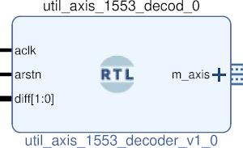

# UTIL AXIS 1553 DECODER
## MIL-STD-1553 TO AXIS
---

   author: Jay Convertino   
   
   date: 2021.05.24  
   
   details: Convert MIL-STD-1553 data into a AXI stream of data of 16 data bits and 8 tuser information bits.  
   
   license: MIT   
   
---

### IP USAGE
#### INSTRUCTIONS

TDATA will contain the 16 bit data payload. TUSER is a 8 bit status register   
that tells what type of data it is (command or data) and if the parity was   
good (1 good, 0 bad).   

* TUSER = {TYY,NA,D,I,P} (7 downto 0)
  * TYY = TYPE OF DATA
    * 000 N/A (SHOULD NEVER HAPPEN)
    * 001 REG (NOT IMPLIMENTED)
    * 010 DATA
    * 100 CMD/STATUS
  * NA = RESERVED FOR FUTURE USE.
  * D = DELAY BEFORE DATA
    * 1 = Delay of 4us or more before data
    * 0 = No delay between data
  * I = INVERT DATA
  * P = PARITY
    * 1 = GOOD
    * 0 = BAD

#### PARAMETERS
* clock_speed : DEFAULT = 20000000 : clock speed of aclk to the core in hz. (needs to be 10x of the sample rate)
* sample_rate : DEFAULT = 2000000 : sample rate of generated signal in hz (minimum 2 MHz, must be an even number, must also divide into the clock evenly).
* bit_slice_offset : DEFAULT = 0 : after data caputre, offset bit to use from capture (only works with higher sample rates, positive only).
* invert_data : DEFAULT = 0 : Invert data, default 0 no inversion. 1 or above is inverted data.
* sample_select : DEFAULT = 0 : When sampling at a the clockrate, during the skip, which sample should be take. (clock_speed/sample_rate = number of samples to select from).

### COMPONENTS
#### SRC

* util_axis_1553_decoder.v
  
#### TB

* tb_1553_dec.vhd
  
### fusesoc

* Simulations are fixed at the moment.
